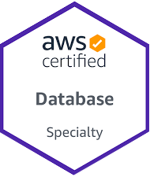
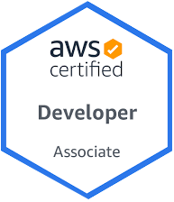
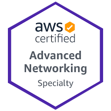
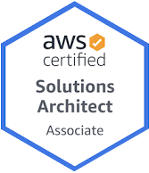
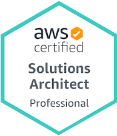
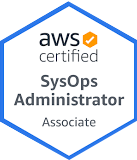
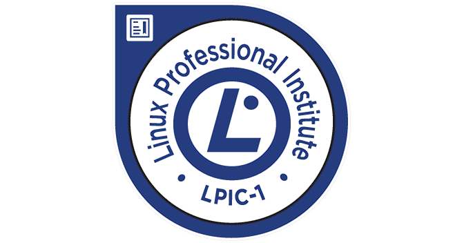

--- 
layout: page
title: ""
---

“Any one can build a bridge that stands, but it takes an engineer to build a bridge that barely stands.”
― Unknown

I'm dedicated to the statability and availabily of our systems and our applications. Since joining Servicing I have made real impact by: being a major part of both RMS and DLS migrations, by reducing cost in our AWS accounts in thousads 
of dollars, by creating our SLI stratigy to track our progress, and by making huge improvements to our alerting. As an SRE its important to set stababily goals and work towards that. 

## Certifications and Awards

1. Jun, 2022 AWS Certified Advanced Networking – Specialty
1. Mar, 2022 AWS Certified Database – Specialty
1. Sep, 2021 AWS Certified Solutions Architect – Professional
1. Apr, 2021 AWS Certified SysOps Administrator - Associate
1. Dec, 2020 AWS Certified Developer - Associate
1. Dec, 2019 AWS Certified Solutions Architect - Associate
1. Jul, 2019 Certified Linux Administrator (LPIC-1) 2 exam
1. Nov, 2019 Certified Linux Administrator (LPIC-1) 1 exam
1. Oct, 2019 Rock Honors Best Execution winner
2. Oct, 2018 Rock Honors Best Execution nominated
3. Nov, 2018 Sys Ops Team member of the month (Last one before the award was retired)
4. Dec, 2017 Sys Ops Team member of the month (First time award was given)

